# 🛒 Laravel + React Магазин Техніки

Мінімалістичний і сучасний інтернет-магазин техніки, створений на базі **Laravel** для бекенду та **React** для
фронтенду. Відрізняється чистим дизайном, плавними градієнтними анімаціями та інтуїтивним UX.

---

## ✨ Функціонал

- 🎨 Головна сторінка з анімованим градієнтом, рухомими елементами та випливаючими вікнами
- 🔍 Мінімалістичний дизайн без зайвих деталей, акцент на продуктах
- 🛍️ Каталог техніки з фільтрами
- 🛒 Кошик покупок з динамічним оновленням
- 📦 Особистий кабінет з історією замовлень
- 🌙 Світла / темна тема

---

## 🎨 Стиль і UI

- Плавні **градієнтні анімації** на головній сторінці
- Анімація руху та збільшення при наведенні на товари
- Випливаючі бокові вікна для додаткових дій та інформації
- Мінімалістичний сірий фон, простота та чистота
- Лаконічні кнопки та назви товарів

---

## 🛠 Технології

| Частина  | Технологія   |
|----------|--------------|
| Backend  | Laravel, PHP |
| Frontend | React        |

---

## 📸 Скріншоти

### 🏠 Головна сторінка — каталог техніки

Плавний градієнтний фон з анімацією, мінімалістичні картки товарів із збільшенням при наведенні.

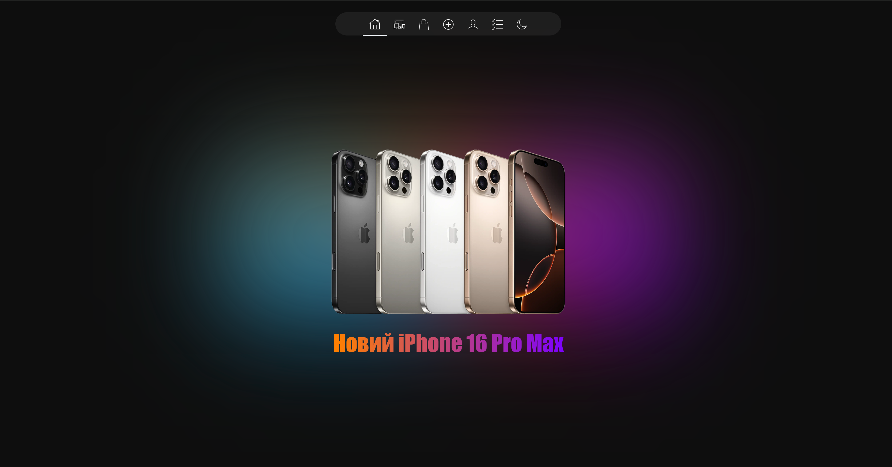

---

### 🔍 Фільтр товарів

Зручний фільтр для швидкого пошуку техніки за категоріями та параметрами.

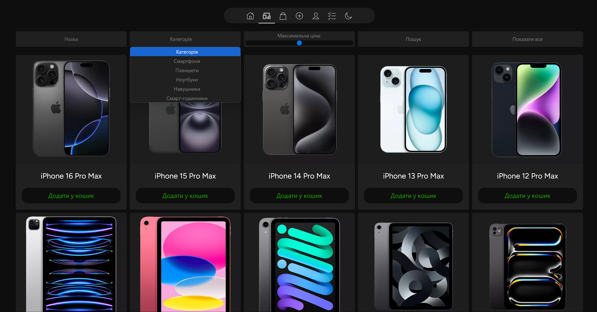

---

### 📦 Перегляд одного товару

Мінімалістична сторінка з детальною інформацією про обраний товар.

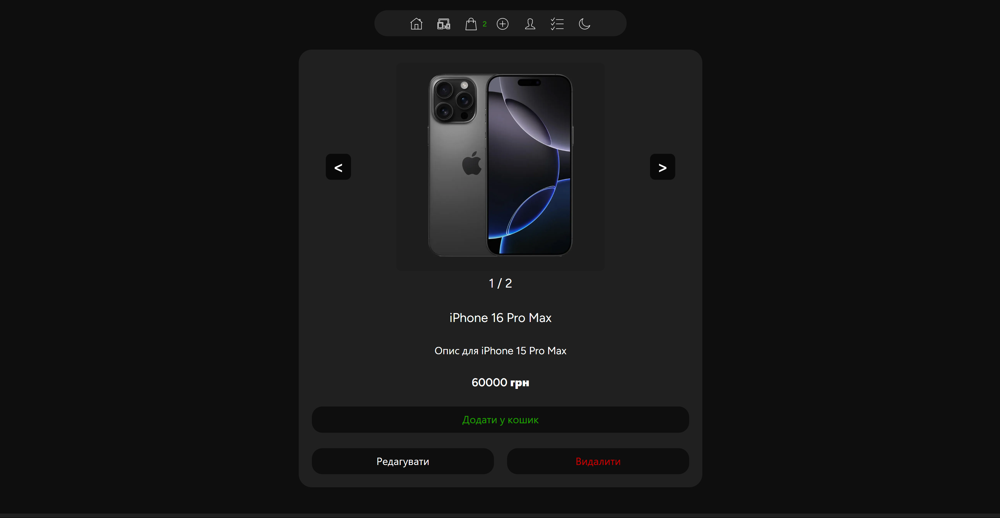

---

### 🛒 Кошик

Динамічний кошик з можливістю редагування кількості та оформлення замовлення.

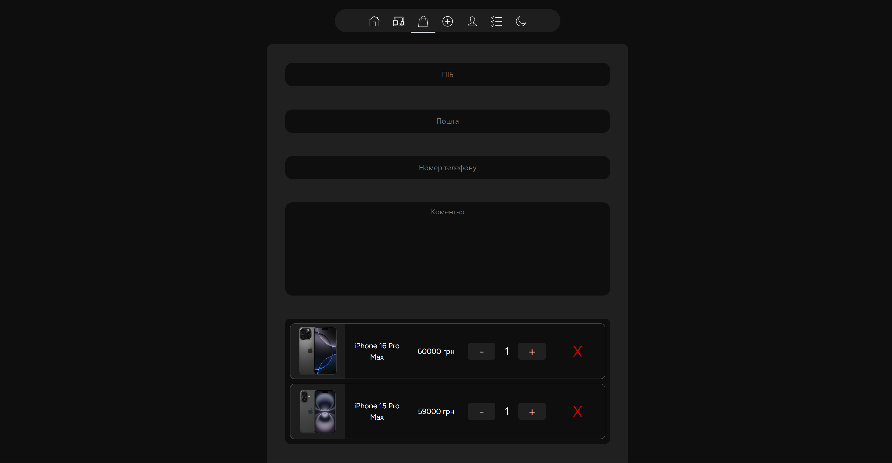  
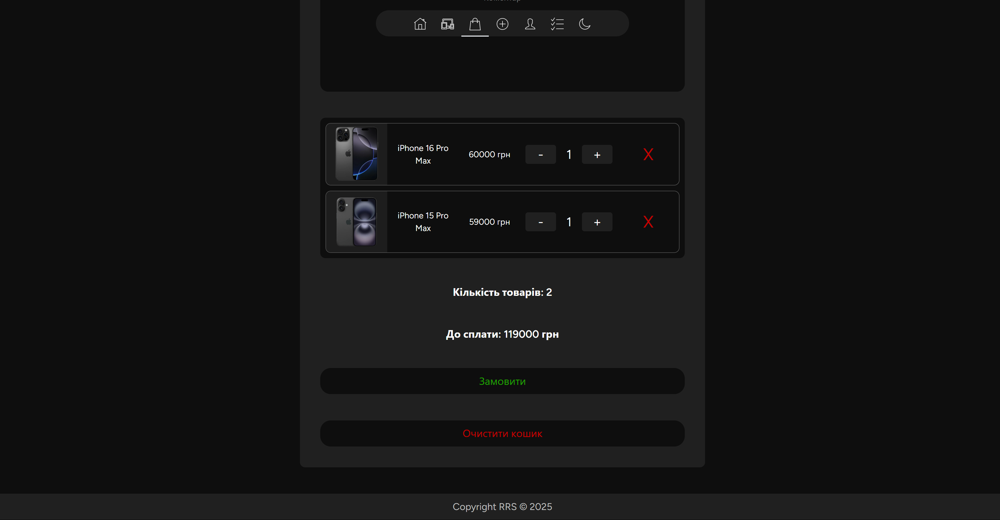

---

### 👤 Кабінет користувача

Історія замовлень із розподілом на активні та виконані замовлення.

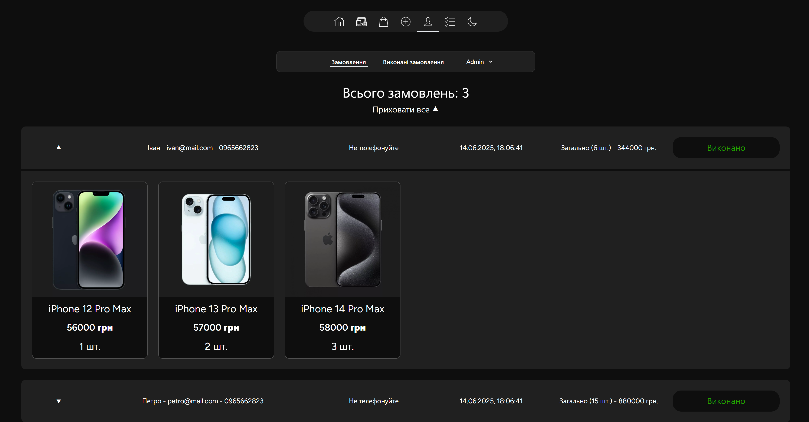

---

### 🌙 Світла тема

Зручний інтерфейс із підтримкою світлої теми для комфортного перегляду.

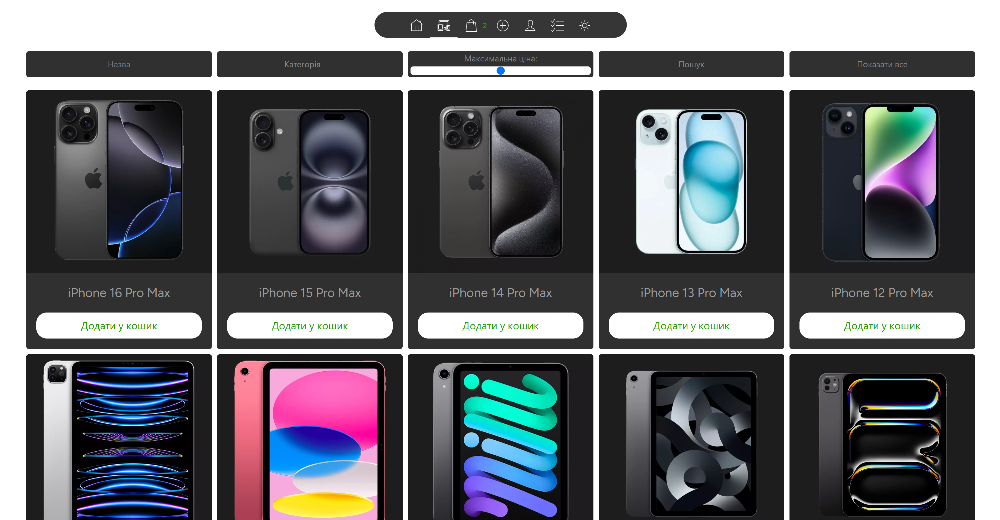

---

### 📋 Таск-менеджер

Простий, мінімалістичний інтерфейс таск-менеджера.

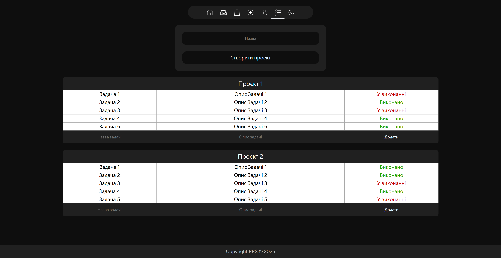
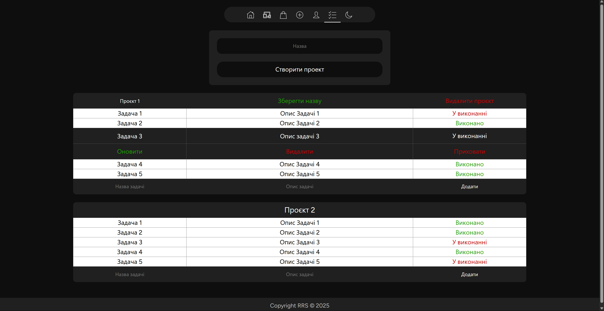
---

### 🧩 Relative Layout (адаптивність)

Приклади адаптивного розташування елементів таск-менеджера на різних розмірах екрану.

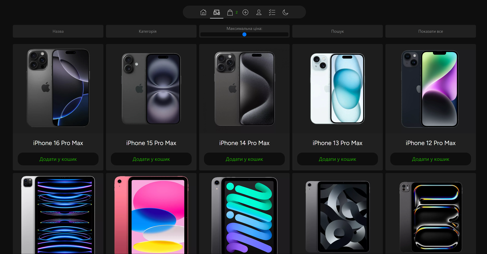  
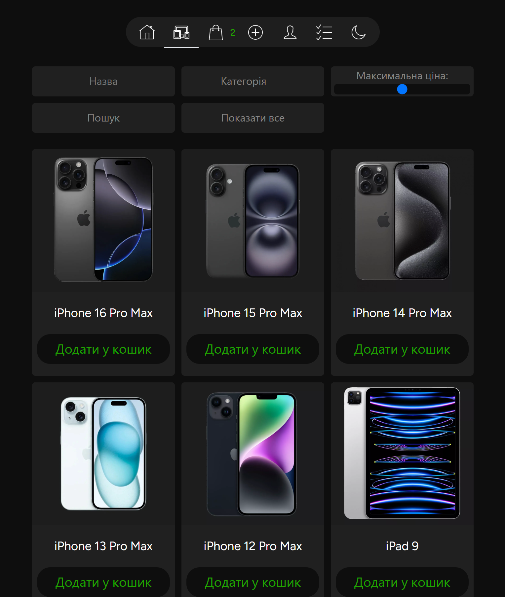  
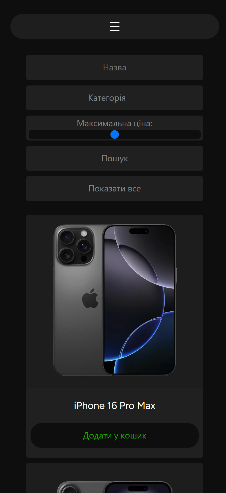

## 🚀 Запуск проєкту

```powershell
composer install
npm install
copy .env.example .env
php artisan key:generate
php artisan migrate
php artisan storage:link
xcopy public\images\product_photos public\storage\product_photos /E /I
php artisan migrate --seed
php artisan serve
npm run dev
```
